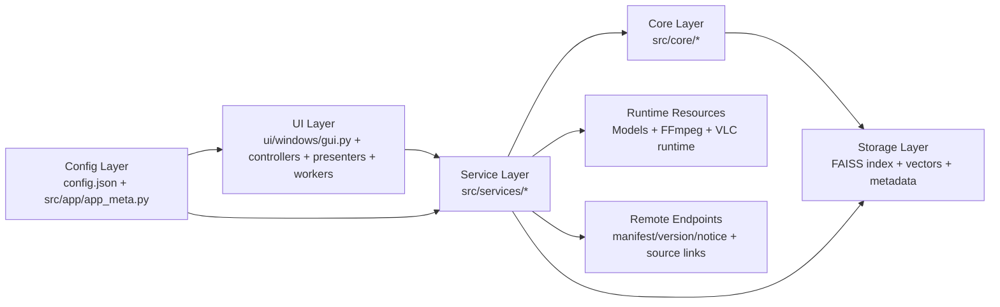
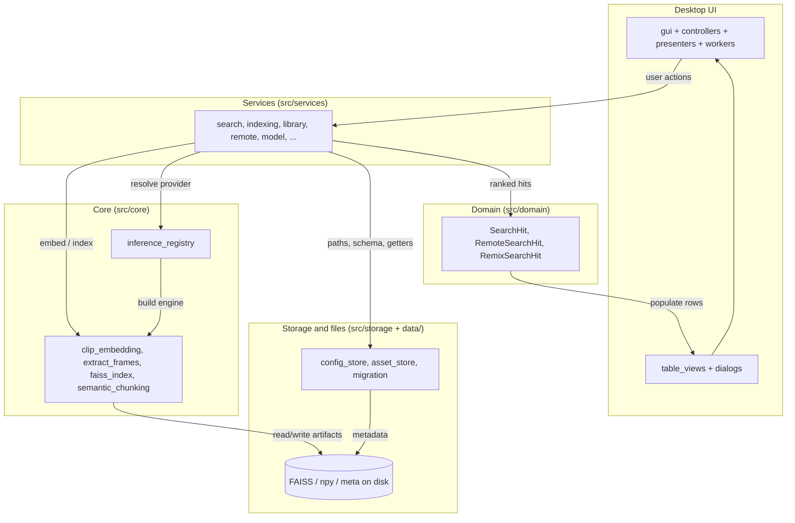
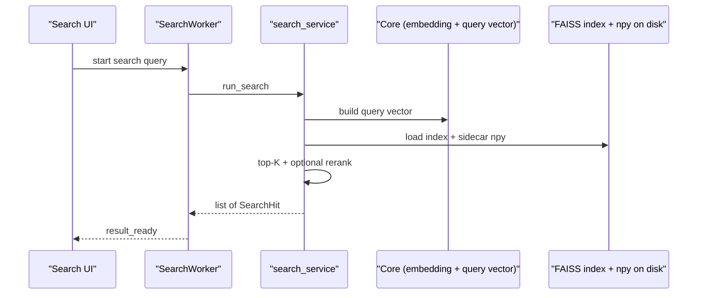

# VideoSeek Architecture

This document summarizes module responsibilities and configuration boundaries.

## System Diagram



### Layered architecture (detail)

The diagram below is a **logical** view: the UI talks only to **services** and **Qt widgets**; services orchestrate **core** routines and **storage**, and pass **domain DTOs** back into the table/view layer for rendering (compatibility shims may still accept legacy tuple/dict at the view boundary).



### Local search path (simplified)



## High-Level Design

- UI layer (`ui/`): receives user actions, updates widgets, and delegates heavy work to background workers; presenters coordinate multi-step network build/precheck flows.
- Service layer (`src/services/`): central business logic for indexing, search, local/remote libraries, runtime resources, model download/packaging, storage orchestration, and notice/version/about.
- Core layer (`src/core/`): embedding inference, frame extraction, tokenizer, semantic chunking, and FAISS-related core operations.
- Storage layer (`src/storage/` + data files): persists vectors, index artifacts, library metadata, and profile/config state.
- Config layer (`config.json` + `src/app/app_meta.py`): separates user-tunable runtime settings from product/distribution metadata.
- Auxiliary HTTP (`src/web/`): local FastAPI mobile bridge and QR display helpers; wired from UI when the companion flow is used.

### Domain models (`src/domain/`)

Small shared types used across services and UI:

- **`SearchHit`**: one local frame/chunk search match (`start_sec`, `end_sec`, `score`, `video_path`). Built in `search_service`; tables and thumbnail loaders accept **`SearchHit` or legacy 4-tuples** via `coerce_search_hit`.
- **`RemoteSearchHit`**: one remote (network) vector search match (`title`, `time_sec`, `score`, `source_link`). Built in `remote_search_service`; `populate_network_result_table` accepts **`RemoteSearchHit` or legacy dicts** via `coerce_remote_search_hit`.
- **`RemixSearchHit`**: one remix-to-source segment (`start_sec`/`end_sec` on source, `remix_start_sec`/`remix_end_sec` on remix, `score`, `video_path`). Built by `remix_match_service` / `remix_match_aggregate`; `populate_remix_result_table` accepts **`RemixSearchHit` or `SearchHit`** via `coerce_remix_search_hit`.

Re-export for convenience: `from src.core.core import run_search, SearchHit, RemoteSearchHit`.

### Inference engines (`src/core/inference_registry.py`)

- Providers register with `register_inference_engine(provider_id, factory)`.
- `clip_embedding.get_engine()` resolves the active model profile’s `provider` through **`build_inference_engine`**, falling back to **`clip_onnx`** when unknown.
- Defaults are registered when `clip_embedding` loads (`clip_onnx`, `siglip2_onnx`).

### Configuration reads (`src/storage/config_store.py`)

Beyond schema v2 profiles and paths, **read-only helpers** centralize defaults for options that were previously scattered `config.get(...)` calls, for example:

- Search: `get_search_mode`, `get_search_top_k`, frame-neighbor rerank getters.
- Remote build: `get_remote_max_frames`, `get_config_fps`.
- Chunk pipeline: `get_similarity_threshold`, `get_max_chunk_duration`, `get_min_chunk_size`, `get_chunk_similarity_mode`.

New code should prefer these getters; remaining legacy reads can be migrated gradually.

## Main Flows

### Local indexing and search

1. UI triggers indexing/search from controller/workers.
2. Services validate settings and resolve runtime resources; user-entered search text may be normalized via `query_text_service` before embedding.
3. Core pipeline extracts frames, computes embeddings, and reads/writes index artifacts.
4. Services return ranked results and metadata to UI for rendering and preview.

### Remote library build

1. UI submits source links and build mode (presenters/controllers orchestrate the Remote Library page).
2. `remote_link_precheck_service` summarizes link risk before heavy work; `remote_library_service` runs staged build: `resolve/download -> extract -> embed -> merge -> index`.
3. Built vectors and FAISS artifacts are written under the configured remote asset paths (`asset_store`, `config_store` helpers). Separately, when `remote_index_manifest_url` is set, `remote_index_service` can download a **packaged** remote index from the network; `remote_search_service` performs query-time vector search against the active remote index state.

### Remix source match

1. User selects a remix file, match parameters, and optional **library scope** (entire index vs checked videos) on the Remix page (`RemixMatchPage` in `ui/widgets/components.py`).
2. `RemixMatchWorker` (`ui/workers.py`) calls `run_remix_match` in `remix_match_service.py`: load or compute remix-frame CLIP vectors (disk cache in `remix_embedding_cache.py`), query FAISS against scoped library vectors, then aggregate raw hits into segments in `remix_match_aggregate.py`.
3. UI renders `RemixSearchHit` rows via `populate_remix_result_table` (`ui/views/table_views.py`); **Compare** opens `RemixCompareDialog` for side-by-side VLC preview.

End-user and cache-path details: **`docs/remix_source_match.md`**.

High-level layout (Python modules). Generated paths mirror the repository; prefer this section over memorizing filenames.

```text
main.py
src/
  domain/
    __init__.py
    remote_search_hit.py
    remix_search_hit.py
    search_hit.py
  app/
    __init__.py
    app_meta.py
    config.py
    copy_overrides.py
    i18n.py
    logging_utils.py
  core/
    __init__.py
    clip_embedding.py
    core.py
    extract_frames.py
    faiss_index.py
    inference_registry.py
    semantic_chunking.py
    siglip_provider_draft.py
    tokenizer.py
  services/
    __init__.py
    about_service.py
    download_utils.py
    ffmpeg_service.py
    indexing_service.py
    library_service.py
    model_package_service.py
    model_service.py
    notice_service.py
    query_text_service.py
    remote_index_service.py
    remote_library_service.py
    remote_link_precheck_service.py
    remote_search_service.py
    remix_embedding_cache.py
    remix_match_aggregate.py
    remix_match_service.py
    runtime_resource_service.py
    search_service.py
    storage_service.py
    version_service.py
  storage/
    __init__.py
    asset_store.py
    config_store.py
    migration_runner.py
  web/
    display_qr.py
    mobile_bridge.py
  workflows/
    __init__.py
    update_video.py
  utils.py
ui/
  __init__.py
  workers.py
  threading_utils.py
  windows/
    __init__.py
    gui.py
    gui_remix.py
    gui_settings.py
    gui_preview.py
    gui_library_indexing.py
    gui_vector_network.py
    gui_runtime.py
    gui_model_packages.py
  controllers/
    __init__.py
    app_meta_controller.py
    indexing_controller.py
    mobile_bridge_controller.py
    network_search_controller.py
    preview_controller.py
    runtime_resource_controller.py
    search_controller.py
  playback/
    __init__.py
    vlc_player.py
    preview_dialog.py
    remix_compare_dialog.py
  views/
    __init__.py
    table_views.py
  presenters/
    __init__.py
    network_build_presenter.py
    network_precheck_presenter.py
  widgets/
    __init__.py
    styles.py
    components.py
    layout.py
    remix_scope_tree.py
  dialogs/
    __init__.py
    about.py
    app_message.py
    common.py
    legacy_resource_table.py
    link_editor.py
    mobile_bridge.py
    model_download.py
    notice.py
    resource_table.py
    sampling_rules.py
tests/
  test_clip_embedding_runtime.py
  test_config.py
  test_controllers.py
  test_download_services.py
  test_extract_frames.py
  test_gui_settings_paths.py
  test_mobile_bridge.py
  test_network_presenters.py
  test_notice_version_utils.py
  test_query_text_service.py
  test_remix_embedding_cache.py
  test_runtime_resource_service.py
  test_semantic_chunking.py
  test_services.py
  test_storage_service.py
  test_workers.py
```

## Configuration Layers

### User-facing config (`config.json`)

Typical local runtime options:
- `theme`
- `language`
- `fps`
- `remote_max_frames`
- `preview_seconds`
- `ffmpeg_path`
- `model_dir`

This file is intended to be safe for end-user edits.

### Product/distribution config (`src/app/app_meta.py`)

Built-in metadata and remote endpoints:
- `version`
- `notice_url`
- `about_url`
- `version_url`
- `model_manifest_url`
- `remote_index_manifest_url`
- `remote_timeout`

This file is intended for product/distribution control rather than user edits.

## Runtime Resource Strategy

- Prefer external runtime resources instead of bundling large artifacts in each release.
- Default external model directory on Windows: `%LOCALAPPDATA%\VideoSeek\models`
- Default managed ffmpeg path: `%LOCALAPPDATA%\VideoSeek\bin\ffmpeg.exe`
- **Documented user path:** maintainer-built **zip** from cloud storage → **Import and Parse** in-app (`model_package_service`).
- **Optional HTTP path:** if `model_manifest_url` points to a **JSON manifest** listing file sources, legacy workers can download ONNX/FFmpeg entries; if the URL is a normal download page instead, use zip import—do not assume automatic weight download.
- Model file requirements come from the active model profile (default profile is `clip_onnx`).

## Remote Library Notes

- Remote Library page separates build and search operations (`network_search_controller`, `network_build_presenter`, `network_precheck_presenter`).
- Build supports both download-based and stream-url matching modes.
- Link precheck (`remote_link_precheck_service`) summarizes accepted/blocked/risky links and avoids heavy work on obvious duplicates.
- Build status reports staged progress: `resolve/download -> extract -> embed -> merge -> index`.

## Mobile bridge (optional)

- `src/web/mobile_bridge.py` exposes a small local HTTP API; `ui/controllers/mobile_bridge_controller.py` and `ui/dialogs/mobile_bridge.py` start/stop the server and surface connection UI.
- `src/web/display_qr.py` renders QR payloads for pairing alongside the bridge UI.
